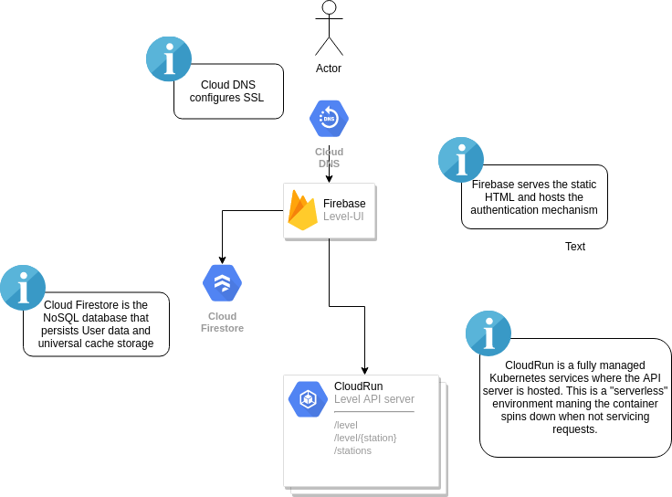

# Level-ui

Level-ui is the front end for the level project: https://level.leetserve.com/

This project is built using the following technologies:

**UI** (this repository)

* [Vue](https://vuejs.org/) - is the framework used to display the web application and as a client side state manager.
* [Firebase](https://firebase.google.com/) - serves the NoSQL database and authentication for the project as well as hosts the front end code. This is a highly scalable hosting platform of the "serverless" flavor

**API** can be found [here](https://github.com/gabeduke/level)

* The API is written in GoLang and is hosted in [CloudRun](https://cloud.google.com/run/) which is a fully managed Kubernetes environment

## Architecture



## Project setup

You will need to install the [Yarn](https://yarnpkg.com/lang/en/) package manager in order to fetch javascript dependencies. Once installed you may run the following commands to serve locally or build a release artifact.


```
yarn install
```

### Compiles and hot-reloads for development
```
yarn serve
```

### Compiles and minifies for production
```
yarn build
```

### Lints and fixes files
```
yarn lint
```
